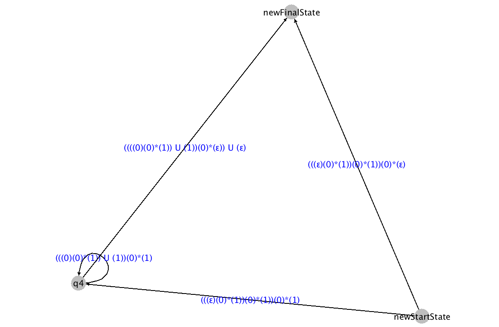

# Regex Visualizer
Visualizes the steps to convert a GNFA to an equivalent regex string using Java and a graphing library called *gs*.




## Running
To run simply type:

```
javac Regex.java && ./runRegex.sh
```

`DFA.java` and `NFA.java` have implementations of their own. If you would like to simulate either you can run `runDFA.sh` and `runNFA.sh` respectively.

`input.txt` contains an example input to demonstrate the format of defining finite state automatas.
